# Humor-Detection-Capstone
Humor-Detection-Capstone for Flatiron School


## Business Understanding:

Stakeholders:
- The stakeholders of the humor detection project may include social media platforms, advertisers, or content creators who want to gauge the effectiveness of their content in eliciting humor.
- For social media platforms, being able to detect humorous content can improve the user experience by prioritizing and promoting content that generates positive emotions.
- Advertisers may want to measure the impact of humorous ads on brand recall and engagement.
- Content creators may want to evaluate the effectiveness of their humor and adjust it accordingly to maximize its impact.

Business Objectives:
- The objective of the humor detection project is to develop a machine learning model that can accurately detect humor in textual content.
- The model should be trained on a large dataset of labeled humorous and non-humorous content.
- The resulting model can then be used to classify new content as either humorous or non-humorous, allowing stakeholders to measure the effectiveness of their content in eliciting humor.

## Data understanding
- In a [2004 paper](https://arxiv.org/abs/2004.12765), the authors Issa Annamoradnejad, Gohar Zoghi provided on a dataset for humor detection consisting of 200,000 formal short texts. 
- This data is contained in the file 'jokes_dataset.csv' in the data folder.
- Each entry has two columns: one for the raw text of the joke and the other for target binary variable 'humor' labled true or false.  Example: "What is a pokemon master's favorite kind of pasta? wartortellini!!" is 'true' for 'humor'.
- The non-humorous texts are short headlines from online news sources. Example: "Kim kardashian baby name: reality star discusses the 'k' name possibility" is 'false' for 'humor'.

## Exploratory Data Analysis

The dataset is balanced in regards to its target variable 'humor.'

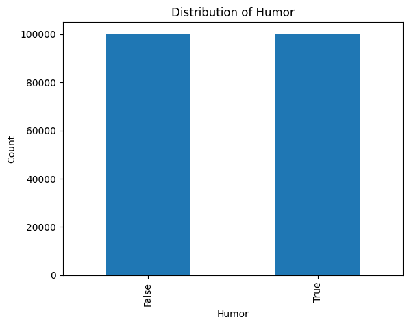

Following removal of stopwords and punctuatino, the length of the values in 'text' column follow a normal distribution and have a mean of 47.84 characters with a minimum of 4 and maximum of 95 characters.

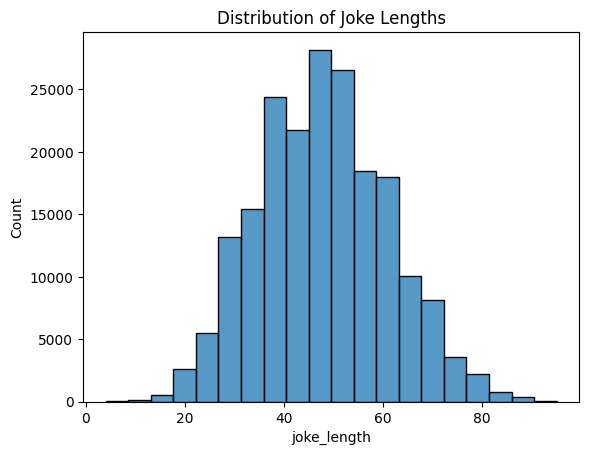

The distribution is similar for jokes vs. non-jokes.

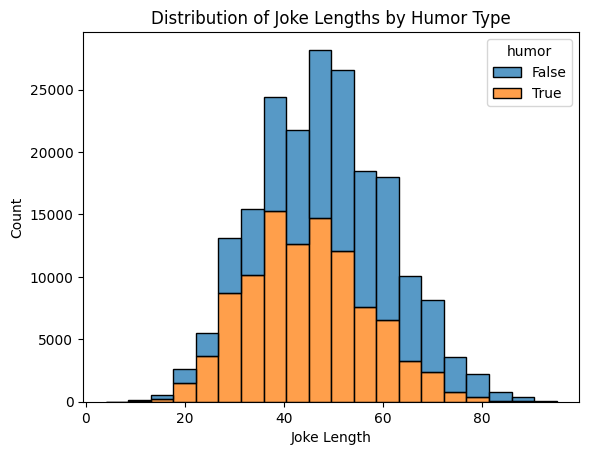

A word cloud was generated to visualize the most common words in a dataset of jokes and non-jokes.

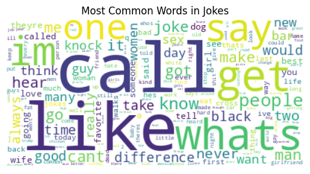
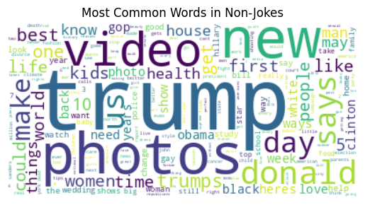

# Universal Sentence Encoder

I used a pre-trained Universal Sentence Encoder model from TensorFlow Hub. The encoded vectors are stored in a list called joke_vectors_list. To encode the jokes in batches, a for loop is used that iterates over the jokes in steps of the batches required due to the size of the dataset. The model object is called on each batch of jokes, and the resulting encoded vectors are appended to the joke_vectors_list list.

Next, cosine similarity is calculated between all pairs of joke vectors using the cosine_similarity function from sklearn.metrics.pairwise. Since the joke vectors array may be too large to calculate cosine similarity between all pairs of vectors at once, the calculation is done in batches. The final similarity_matrix contains cosine similarity values for all pairs of joke vectors.

A user will be prompted to enter a string to encode and assess cosine similarity to the list of jokes and return the most similar rows.

Given a user's input, encode it into a vector representation using the same Universal Sentence Encoder model.

```
user_input = input("Enter a sentence: ")

```
Get the number of jokes to recommend from the user

```
num_jokes = int(input("How many jokes would you like to see? "))
```

Print the top-n jokes

```
print(f"Top {num_jokes} jokes:")
for i, joke in enumerate(top_jokes):
    print(f"{i+1}. {joke.text}")
```

I enter the phrase "Dr. Seuss cat in the hat" and enter "5" for number of results to show.

```
Top 5 jokes:
1. What did dr. seuss call the book he wrote about star wars? the cat in the at-at
2. What was schrodinger's favorite childhood book? the cat in the box by dr. seuss
3. What is dr. seuss' favorite play? green eggs and hamlet
4. Did you read dr seuss as a kid because green eggs and damn
5. What do you call a magician in a dr. seuss book? who-dini
```

## Topic modeling

LDA is used as a topic modeling technique to discover latent topics in a collection of documents. It models each topic as a probability distribution over the words in the vocabulary to explain the topic-word distributions.

For topic modeling with LDA, lemmatization, tokenization and vectorization are used to prepare the text data for input into the model. TfidfVectorizer is used to tokenize the lemmatized text data, and an LDA model is created and trained on the tokenized data. I analyze the topic structure of the jokes in the dataset and print the top words for each topic using get feature names.

```
feature_names = vectorizer.get_feature_names_out()

for i in range(num_topics):
    topic_words = ' '.join([feature_names[idx] for idx in np.argsort(lda_model.components_[i])[:-11:-1]])
    print(f"Topic {i}:\n{topic_words}\n")

```
```
Topic 0:
one, make, man, day, time, it, never, two, take, women
Topic 1:
trump, donald, trumps, clinton, hillary, says, president, gop, us, obama
Topic 2:
get, cross, road, chicken, side, it, married, christmas, cant, pregnant
Topic 3:
people, black, world, white, cant, hate, types, 10, think, racist
Topic 4:
new, photos, york, years, video, week, year, fashion, best, 10
```

The function "get_top_tokens" is defined to extract the most important words for each topic, along with their corresponding weights, for the 5 defined topics. The feature names for the vectorizer used to process the input documents are obtained using the "get_feature_names_out" method. Finally, a bar plot is generated for each topic, displaying the top tokens and their weights.

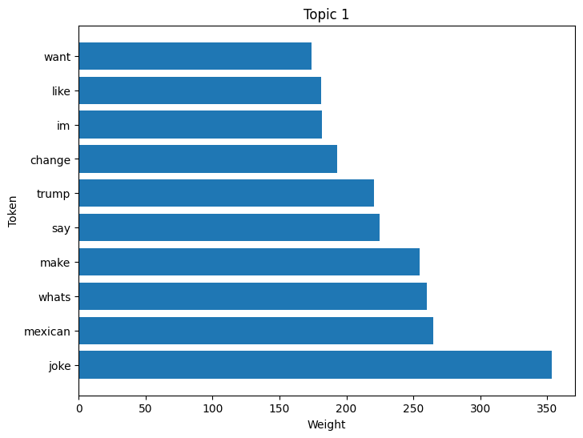
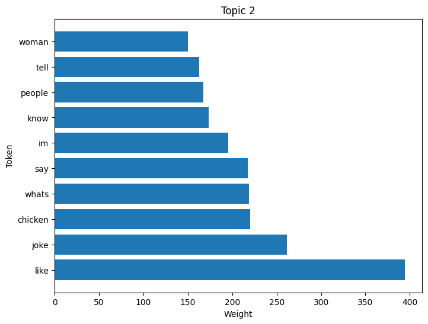
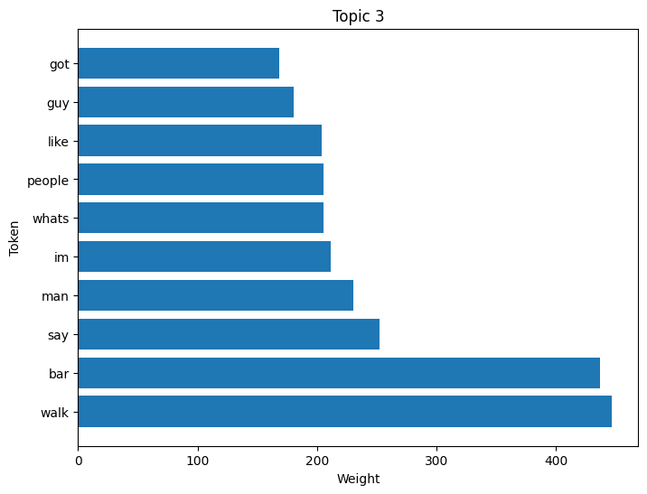
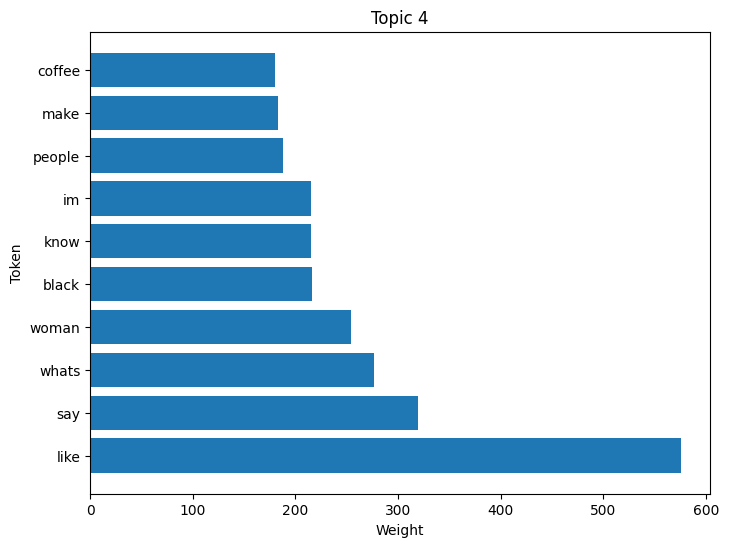
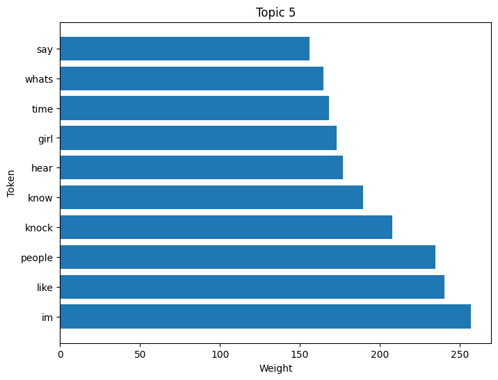

Then I applied t-SNE to visualize the topic distributions of the documents in a 2D plot.
I used the LDA model to transform the tokenized data into topic distributions for each document and a TSNE object to apply the t-SNE algorithm to the topic distributions of the documents. This is needed to reduce dimensionality for visual inspection.

I created a a scatter plot of the t-SNE output using different colors for each topic. Each point on the plot represents a document, and the color of the point indicates its assigned topic. The legend on the plot shows which color corresponds to each topic.

IMAGE HERE

Documents that are closer together on the plot are more similar in terms of their topic distributions, while documents that are farther apart are less similar. 

I created a similar plot with binary labels in the y array, which indicate whether a joke is humorous or not representing their similarity based on their TF-IDF representations.

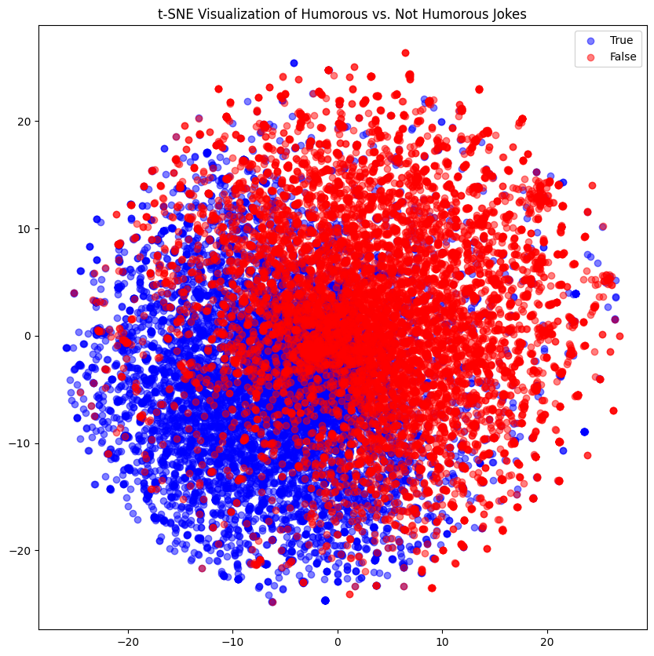

#

## Classification Modeling

For this binary classification problem of selecting whether humor = 'true' or 'false' based on the clean text data, I analyzed 12 different models.

1. Simple logistic regression model using TFIDF vectorization
2. Logistic regression with lemmatization to test if lemmatization will help accuracy
3. Support Vector Machines (SVM) model
4. Random Forest with gridsearch
5. K Nearest Neighbors with gridsearch
6. XGBoost classification model
7. Basic neural network
8. Neural network with regularization
9. Neural network with dropout
10. Convolutional Neural Network (CNN)
11. Recurrent Neural Network (RNN)
12. Naive Bayes

## Results

Accuracy is the metric of greatest importance to our analysis and selection of a final model.

| Model | Training Accuracy | Test Accuracy |
|-------|------------------|---------------|
| Model 1 | 0.92921875 | 0.9108 |
| Model 2 | 0.92335625 | 0.905625 |
| Model 3 | 0.94555 | 0.9144 |
| Model 4 | 0.897475 | 0.85495 |
| Model 5 | 1.0 | 0.824 |
| Model 6 | 0.789875 | 0.7675 |
| Model 7 | 0.9999374747276306 | 0.8657500147819519 |
| Model 8 | 0.8952500224113464 | 0.843999981880188 |
| Model 9 | 0.999875009059906 | 0.862500011920929 |
| Model 10 | 0.9991250038146973 | 0.8542500138282776 |
| Model 11 | 0.9983749985694885 | 0.8497499823570251 |
| Model 12 | 0.947 | 0.8835 |

Lemmatization was used in model 2 to test if lemmatization will help accuracy but it was determined to decrease accuracy. Part-of-speech tagging was then tested in model 3 and did ___. 

## Evaluation

In this project, we aimed to develop a model to classify whether a given text is humorous or not. We used a dataset of 20,000 jokes for training and testing various machine learning models.

We started with a simple logistic regression model using TFIDF vectorization, which achieved a training accuracy of 0.92921875 and a test accuracy of 0.9108. We then tried lemmatization with logistic regression, which achieved a training accuracy of 0.92335625 and a test accuracy of 0.905625.

We also experimented with Support Vector Machines (SVM), which achieved a training accuracy of 0.94555 and a test accuracy of 0.9144. Random Forest with grid search, K nearest neighbors with grid search, XGBoost classification model, basic neural network, neural network with regularization, neural network with dropout, CNN, and RNN models were also evaluated.

SVM model was the best performing model with a test accuracy of 0.9144. 

CLASSIFICATION REPORT

Confusion matrix for final SVM model:
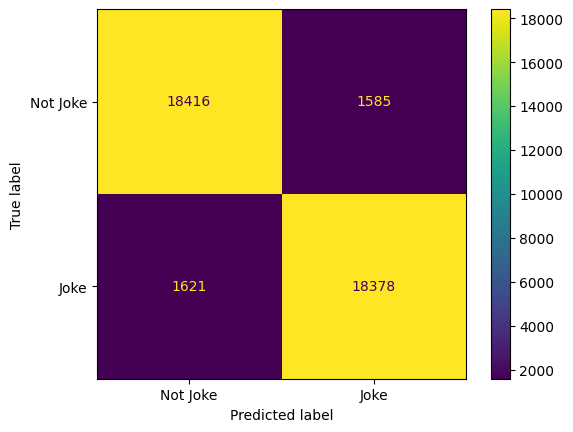

ROC curve for final SVM model:
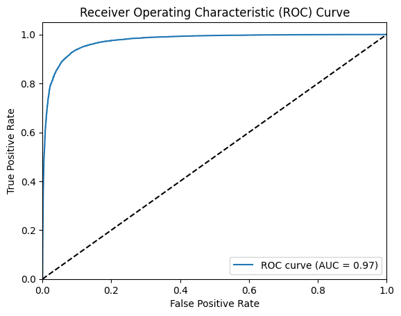

Overall, the results demonstrate that machine learning models can be effective at classifying texts as humorous or not. Future work could involve using larger datasets or exploring more complex models, such as deep learning models, to achieve even better performance.


## Conclusion and Recommendations

Based on the results of the classification modeling, we can conclude that the SVM model performed the best with a test accuracy of 0.9144, closely followed by the simple logistic regression model using TFIDF vectorization with a test accuracy of 0.9108. It is worth noting that some models performed significantly worse, such as the XGBoost classification model and the K Nearest Neighbors model, which suggests that these models may not be suitable for this particular problem.

In terms of recommendations, we suggest using the SVM model or the simple logistic regression model with TFIDF vectorization for this task, as they both demonstrated high accuracy in predicting the classification of jokes. Additionally, it may be worth exploring other natural language processing techniques, such as stemming or part-of-speech tagging, to see if they can further improve the accuracy of the models. Finally, it may be beneficial to collect more data and expand the dataset to improve the models' generalizability.
